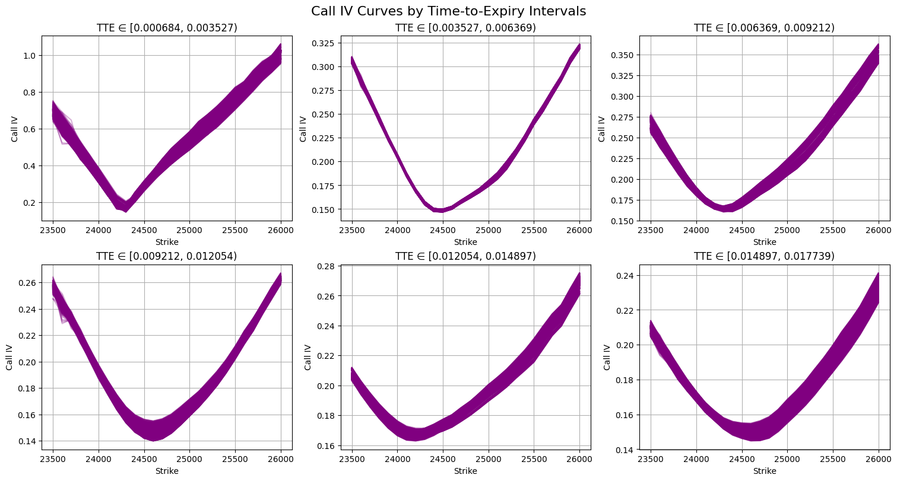
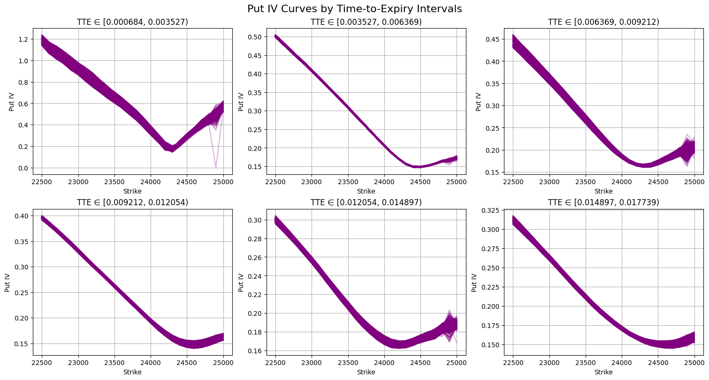
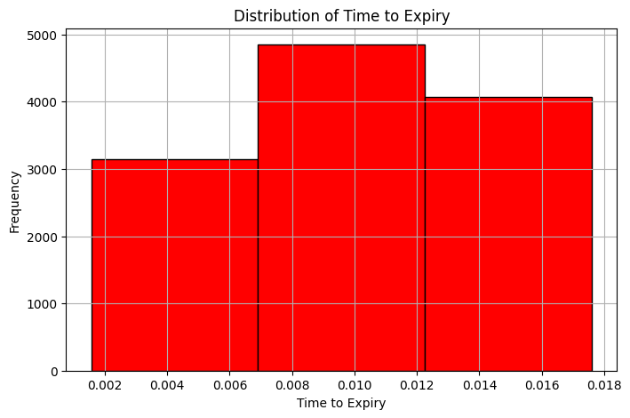
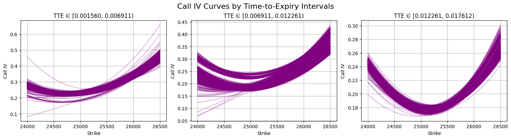

# NIFTY50 Implied Volatility Prediction

**Author:** Mimat Singh  
**Date:** June 11, 2025

## 🧠 Problem Understanding

This competition focuses on predicting missing Implied Volatility (IV) values for NIFTY50 index options. IV reflects the market’s expectation of future price movement and plays a key role in pricing options.

We are given time-series IV data with expiry dates for different call and put strike values. However, time to expiry (TTE) is not provided in the test data. The goal is to impute the missing IVs using available information.

---
📦 [Download dataset from here.](https://drive.google.com/drive/folders/1yaGMMjxwF0fCOytLM_iEGqyV8N9SS44F?usp=sharing)

---

## 📊 My Approach

### a. Data Exploration

After analyzing IV values in the training data, many outliers were found. I filtered the rows to retain only those where all IVs were within the range `[0, 5]`, resulting in 178,041 rows (~99.8% of the dataset).

Next, TTE was computed using the timestamp and expiry date, accounting for the Indian share market close time (3:30 PM IST).

From the figure above, TTE was divided into 6 intervals:

1. 0.000684 to 0.003527  
2. 0.003527 to 0.006369  
3. 0.006369 to 0.009212  
4. 0.009212 to 0.012054  
5. 0.012054 to 0.014897  
6. 0.014897 to 0.017739

Call and Put IV smile curves were plotted across these intervals.

  
*Call IV smile curves for each interval*

  
*Put IV smile curves for each interval*

This showed that smile curves heavily depend on TTE — a key feature for IV prediction.

---

### b. Predicting TTE for Test Data

Since X features are proprietary and unrelated to TTE, and TTE is required for IV calculation via Black-Scholes, I aimed to predict it.

Steps:
- Fit a 2nd-degree polynomial on known call IVs in test data to estimate curve shape.
- Used this to train models (XGBoost, LightGBM, MLP) to predict TTE.
- Best model: **XGBoost Regressor** with MSE ≈ `4.92e-10`.

Features used: `Underlying` and common `Call IVs`.

Test TTEs were grouped into 3 intervals, and approximate IV curves showed clear shape consistency within each.

---

### c. Predicting IVs for Test Data

With TTE predicted:
- Extracted statistical features (mean, std, entropy) from `X0...X41`, grouped by TTE interval.
- Converted test data from wide to long format, dropped rows with missing IVs.
- Trained two separate **XGBoost Regressors** — one for call IVs and another for put IVs.

Features used:
- `Underlying`, `Strike`, `TTE`
- Mean, std, entropy of `X0...X41`

MSE on training:
- **Call IV:** `7.16e-06`  
- **Put IV:** `6.22e-06`

Final predictions were made using the trained models.

---

## ✅ Conclusion

This project helped in:
- Understanding market dynamics
- Modeling IV surfaces
- Exploring TTE’s importance

### 🚀 Future Work
- Use clustering (e.g., K-Means) to group smile curves
- Apply deep learning
- Model IV dynamics over time

---

## 👤 Author

**Mimat Singh**  
June 11, 2025
